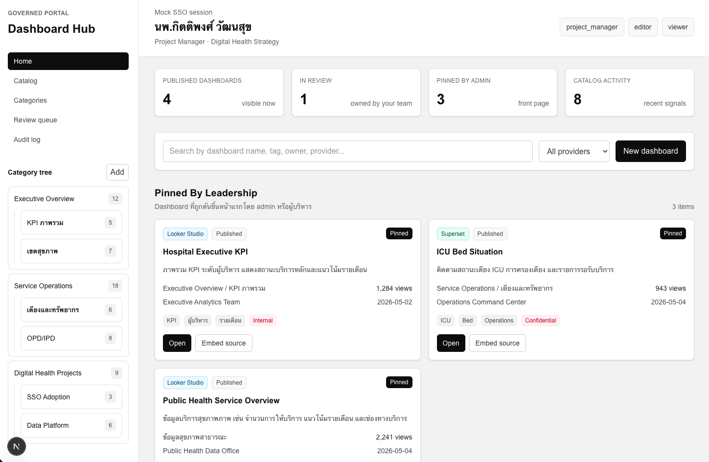
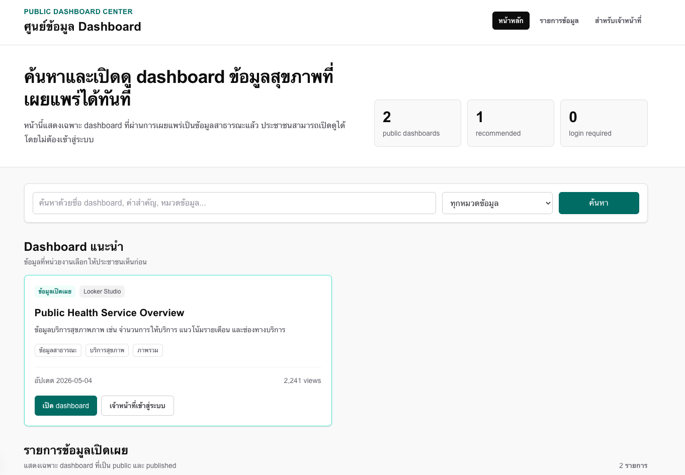

# Dashboard Hub

Governed Dashboard Portal สำหรับบริหารจัดการ dashboard แบบ embed จากระบบภายนอก เช่น Looker Studio, Superset, Grafana, Metabase, Power BI หรือ provider อื่น ๆ

แนวคิดหลักของระบบคือให้หน่วยงานมีศูนย์กลางสำหรับจัดหมวดหมู่ dashboard, กำหนดสิทธิ์, ค้นหา, pin รายการสำคัญ, แยกข้อมูล public/internal และเตรียมต่อยอด workflow แบบ review/publish ในอนาคต

## Screenshots

### Internal Portal

มุมมองผู้ใช้ที่ login แล้วผ่าน mock SSO session พร้อม role, category tree, dashboard ยอดนิยม, รายการล่าสุด, dashboard ของทีม และ favorite



### Public Dashboard Center

หน้า public สำหรับประชาชนทั่วไป เปิดดู dashboard ที่เป็นข้อมูลสาธารณะได้โดยไม่ต้อง login



## Current Scope

ตอนนี้เป็น first slice สำหรับขึ้นระบบให้เห็นภาพรวมก่อน โดยยังใช้ mock data ทั้งหมด

- หน้า internal portal ที่ `/`
- หน้า public portal ที่ `/public`
- หน้า dashboard catalog ที่ `/catalog`
- หน้า embedded dashboard viewer ที่ `/dashboards/[id]`
- หน้า mock create dashboard ที่ `/dashboards/new`
- client-side validation, iframe preview และ mock submit result สำหรับ create flow
- embed status policy: embeddable, unknown, external_only, blocked
- mock SSO user, roles และ team
- mock category tree
- mock dashboard catalog
- section หน้า Home: pinned, popular, recently updated, my team, favorites
- แยก public dashboard ด้วย `status: published` และ `sensitivity: public`
- fallback link สำหรับเปิด dashboard provider ภายนอก

## Routes

| Route | Description |
| --- | --- |
| `/` | Internal dashboard portal สำหรับผู้ใช้ที่ login แล้ว |
| `/public` | Public dashboard center สำหรับประชาชนทั่วไป |
| `/catalog` | Internal dashboard catalog พร้อม action ตาม permission mock |
| `/dashboards/db-001` | Embedded dashboard viewer ตัวอย่างด้วย Looker Studio |
| `/dashboards/new` | Mock create dashboard form |

## Project Structure

```text
src/
  app/
    page.tsx              # Internal portal home
    catalog/page.tsx      # Internal catalog management
    dashboards/[id]/page.tsx # Embedded dashboard viewer
    dashboards/new/page.tsx # Mock create dashboard route
    dashboards/new/new-dashboard-form.tsx # Client form validation and preview
    public/page.tsx       # Public dashboard center
    layout.tsx
    globals.css
  lib/
    portal-types.ts       # Shared roles, permissions, user, category, dashboard types
    mock-auth.ts          # Mock JWT payload and current user mapping
    permissions.ts        # Permission helper functions
    category-utils.ts     # Category tree helpers
    embed-policy.ts       # Embed URL assessment and status tone helpers
    mock-portal-data.ts   # Mock categories and dashboards

docs/
  1.governed-dashboard-portal-phases.md
  2.roles-permissions.md
  3.category-dashboard-model.md
  4.embed-provider-strategy.md

public/
  screenshort/
    ss1.png
    ss2.png
```

## Development

Install dependencies:

```bash
npm install
```

Run the development server:

```bash
npm run dev
```

Open:

- [http://localhost:3000](http://localhost:3000)
- [http://localhost:3000/public](http://localhost:3000/public)

Build:

```bash
npm run build
```

Lint:

```bash
npm run lint
```

## Auth And Data Plan

ระบบจริงจะรับ SSO/JWT จากระบบ auth หลักของหน่วยงาน โดย JWT จะระบุข้อมูลผู้ใช้, role, team และ permission ที่ระบบ portal ใช้ตัดสินสิทธิ์

ในช่วง mock นี้ยังไม่มีการเชื่อมฐานข้อมูลและยังไม่อ่าน JWT จริง ข้อมูลทั้งหมดอยู่ใน:

```text
src/lib/mock-portal-data.ts
```

## Roadmap

เอกสาร phase หลักอยู่ที่:

[docs/1.governed-dashboard-portal-phases.md](docs/1.governed-dashboard-portal-phases.md)

เอกสาร role/permission และ data model:

- [docs/2.roles-permissions.md](docs/2.roles-permissions.md)
- [docs/3.category-dashboard-model.md](docs/3.category-dashboard-model.md)
- [docs/4.embed-provider-strategy.md](docs/4.embed-provider-strategy.md)

phase ที่ควรต่อยอด:

- dashboard CRUD
- real form submission and validation
- embed provider strategy
- publish/review workflow
- usage analytics และ stale dashboard warning
