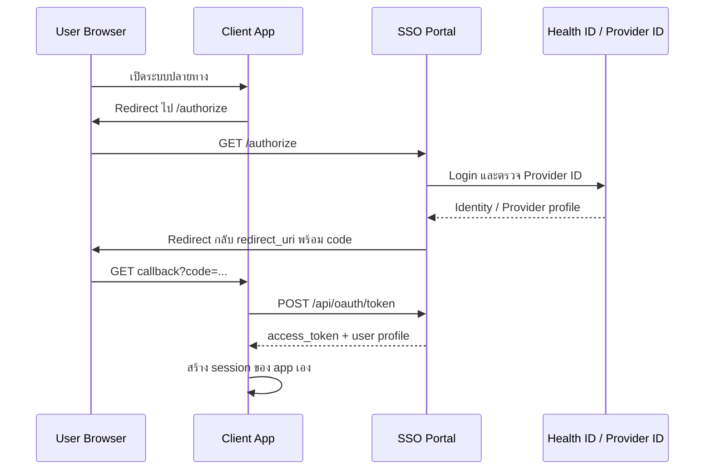

# Client App Integration Guide

คู่มือนี้สำหรับระบบปลายทางที่ต้องการใช้ Provider ID SSO Portal เป็นระบบ login กลาง

## ภาพรวม Flow



## สิ่งที่ต้องเตรียม

ให้ผู้ดูแล SSO Portal สร้าง Client App ที่ `/admin/apps`

ข้อมูลที่ Client App จะได้รับ:

- `SSO_URL` เช่น `https://sso.example.go.th`
- `CLIENT_ID`
- `CLIENT_SECRET`
- `REDIRECT_URI` ที่ลงทะเบียนไว้

เก็บ `CLIENT_SECRET` ไว้ฝั่ง server เท่านั้น ห้ามใส่ใน browser, mobile app bundle, JavaScript frontend หรือ public repository

ตัวอย่าง environment variables ของ Client App:

```text
SSO_URL=https://sso.example.go.th
SSO_CLIENT_ID=your-client-id
SSO_CLIENT_SECRET=your-client-secret
SSO_REDIRECT_URI=https://your-app.example.go.th/auth/sso/callback
```

## 1. Redirect User ไป Login

เมื่อผู้ใช้ยังไม่มี session ใน Client App ให้ redirect browser ไปที่:

```text
{SSO_URL}/authorize?client_id={CLIENT_ID}&redirect_uri={URL_ENCODED_REDIRECT_URI}&state={RANDOM_STATE}
```

ตัวอย่าง:

```text
https://sso.example.go.th/authorize?client_id=my-app&redirect_uri=https%3A%2F%2Fmy-app.example.go.th%2Fauth%2Fsso%2Fcallback&state=8d1f0c5d9e
```

ข้อกำหนด:

- `client_id` ต้องตรงกับที่สร้างใน SSO Portal
- `redirect_uri` ต้องตรงแบบ exact match กับค่าที่ลงทะเบียนไว้
- `state` ต้องสุ่มทุกครั้ง เก็บไว้ใน session/cookie ของ Client App และตรวจกลับตอน callback เพื่อกัน CSRF

## 2. รับ Callback จาก SSO

หลัง login สำเร็จ SSO จะ redirect กลับมาที่ `REDIRECT_URI`:

```text
{REDIRECT_URI}?code={ONE_TIME_CODE}&state={RANDOM_STATE}
```

Client App ต้องตรวจ:

- `state` ที่ส่งกลับมาต้องตรงกับที่เคยสร้างไว้
- ถ้าไม่มี `code` ให้ถือว่า login ไม่สำเร็จ
- `code` เป็น one-time code ใช้ได้ครั้งเดียวและหมดอายุเร็ว

กรณีถูกปฏิเสธหรือ policy ไม่ผ่าน อาจได้:

```text
{REDIRECT_URI}?error=access_denied&error_description={REASON}
```

## 3. Exchange Code เป็น Access Token

ขั้นตอนนี้ต้องทำจาก backend/server ของ Client App เท่านั้น

```text
POST {SSO_URL}/api/oauth/token
Content-Type: application/json
```

Request body:

```json
{
  "grant_type": "authorization_code",
  "code": "{ONE_TIME_CODE}",
  "redirect_uri": "{REDIRECT_URI}",
  "client_id": "{CLIENT_ID}",
  "client_secret": "{CLIENT_SECRET}"
}
```

Response:

```json
{
  "token_type": "Bearer",
  "expires_in": 900,
  "access_token": "{APP_ACCESS_TOKEN}",
  "user": {
    "id": "usr_xxxxx",
    "provider_id": "07500C74170F9",
    "account_id": "34038718629193",
    "name_prefix": "Mr.",
    "name": "Nakhon",
    "surname": "Mongkolchotyada",
    "birthdate": "1985-12-02",
    "mobile_no": "0966926966",
    "hash_cid": "sha256-hash",
    "name_th": "นคร มงคลโชติญาดา",
    "name_eng": null,
    "organizations": [
      {
        "hcode": "00037",
        "hname_th": "สำนักงานสาธารณสุขจังหวัดเชียงใหม่",
        "hname_eng": null,
        "position": "นักวิชาการคอมพิวเตอร์",
        "position_type": "IT",
        "license_id_verify": false,
        "is_hr_admin": true,
        "is_director": false
      }
    ]
  }
}
```

`expires_in: 900` หมายถึง access token มีอายุ 900 วินาที หรือ 15 นาที

หลังได้รับ response แล้ว Client App ควรสร้าง session ของตัวเอง เช่น secure HTTP-only cookie แล้วใช้ข้อมูล `user` เพื่อผูกกับ user ภายในระบบปลายทาง

## 4. ตรวจ Token ด้วย Introspection

ถ้า Client App ต้องการให้ SSO Portal ตรวจ token ให้เรียก:

```text
POST {SSO_URL}/api/oauth/introspect
Content-Type: application/json
```

Request body:

```json
{
  "token": "{APP_ACCESS_TOKEN}",
  "client_id": "{CLIENT_ID}",
  "client_secret": "{CLIENT_SECRET}"
}
```

Active response:

```json
{
  "active": true,
  "sub": "07500C74170F9",
  "aud": "my-app",
  "exp": 1785981602,
  "account_id": "34038718629193",
  "name_prefix": "Mr.",
  "name": "Nakhon",
  "surname": "Mongkolchotyada",
  "birthdate": "1985-12-02",
  "mobile_no": "0966926966",
  "hash_cid": "sha256-hash",
  "name_th": "นคร มงคลโชติญาดา",
  "organizations": []
}
```

Inactive response:

```json
{
  "active": false
}
```

หมายเหตุ: ถ้า Client App ใช้ token เฉพาะตอน callback เพื่อสร้าง session ของตัวเอง อาจไม่จำเป็นต้องเรียก introspection ทุก request

## ตัวอย่าง Node.js Backend

ตัวอย่าง callback endpoint แบบ Express:

```js
import crypto from "node:crypto";
import express from "express";

const app = express();
app.use(express.json());

app.get("/auth/sso/start", (req, res) => {
  const state = crypto.randomUUID();

  req.session.ssoState = state;

  const url = new URL("/authorize", process.env.SSO_URL);
  url.searchParams.set("client_id", process.env.SSO_CLIENT_ID);
  url.searchParams.set("redirect_uri", process.env.SSO_REDIRECT_URI);
  url.searchParams.set("state", state);

  res.redirect(url.toString());
});

app.get("/auth/sso/callback", async (req, res) => {
  const { code, state, error } = req.query;

  if (error) {
    return res.status(401).send("SSO login denied");
  }

  if (!code || state !== req.session.ssoState) {
    return res.status(400).send("Invalid SSO callback");
  }

  const tokenResponse = await fetch(`${process.env.SSO_URL}/api/oauth/token`, {
    method: "POST",
    headers: { "Content-Type": "application/json" },
    body: JSON.stringify({
      grant_type: "authorization_code",
      code,
      redirect_uri: process.env.SSO_REDIRECT_URI,
      client_id: process.env.SSO_CLIENT_ID,
      client_secret: process.env.SSO_CLIENT_SECRET,
    }),
  });

  if (!tokenResponse.ok) {
    return res.status(401).send("SSO token exchange failed");
  }

  const tokenData = await tokenResponse.json();

  req.session.user = {
    providerId: tokenData.user.provider_id,
    accountId: tokenData.user.account_id,
    hashCid: tokenData.user.hash_cid,
    nameTh: tokenData.user.name_th,
    organizations: tokenData.user.organizations,
  };

  res.redirect("/");
});
```

## User Key ที่แนะนำ

ให้ใช้ `provider_id` เป็น key หลักสำหรับผูก user ข้ามระบบ

ใช้ `hash_cid` สำหรับกรณีต้อง match หรือ deduplicate กับข้อมูลเดิมที่มี hash CID อยู่แล้ว

ห้ามคาดหวังว่าจะถอด `hash_cid` กลับเป็นเลขบัตรประชาชนได้ เพราะเป็น SHA-256 แบบ one-way จากเลขบัตรที่ normalize แล้ว

## App Permission

SSO Portal ควรใช้ policy ระดับกว้างเท่านั้น เช่น:

- app นี้ต้องมี Provider ID หรือไม่
- จำกัด `hcode` หรือไม่
- จำกัด `position_type` หรือไม่
- ต้องมี verified license หรือไม่

สิทธิ์ละเอียดในระบบปลายทาง เช่น role, menu, workflow approval, data scope ให้ Client App จัดการเอง

## Error ที่ควรรองรับ

Client App ควรรองรับ error เหล่านี้:

- `access_denied` จาก callback
- `Invalid client credentials or redirect_uri.`
- `Authorization code is invalid, expired, or already used.`
- token หมดอายุ
- user ไม่มี organization หรือ policy ไม่ผ่าน

## Security Checklist

- เก็บ `CLIENT_SECRET` เฉพาะฝั่ง server
- ใช้ HTTPS ใน production
- ตรวจ `state` ทุกครั้ง
- อย่า reuse authorization code
- สร้าง session ของ Client App ด้วย HTTP-only secure cookie
- อย่า log `client_secret`, `access_token`, หรือข้อมูลส่วนบุคคลเกินจำเป็น
- ตั้ง session timeout ของ Client App ให้เหมาะสมกับระบบ
- ถ้าต้อง sync user ลงฐานข้อมูลของ Client App ให้เก็บเท่าที่จำเป็น

## Checklist สำหรับ Go Live

- Client App ถูกสร้างใน `/admin/apps`
- Redirect URI ใน Client App ตรงกับที่ลงทะเบียนไว้แบบ exact match
- ทดสอบ login สำเร็จ 1 รอบ
- ทดสอบ callback error
- ทดสอบ code exchange สำเร็จ
- ทดสอบ code ซ้ำต้อง fail
- ทดสอบ token หมดอายุ
- ตรวจว่า frontend ไม่มี `CLIENT_SECRET`
- ตรวจ audit log ที่ SSO Portal หลังทดสอบ
